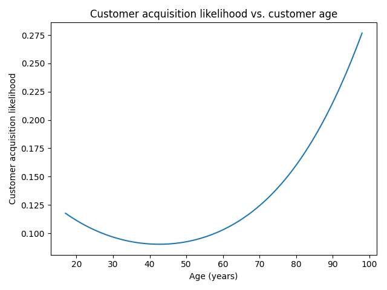
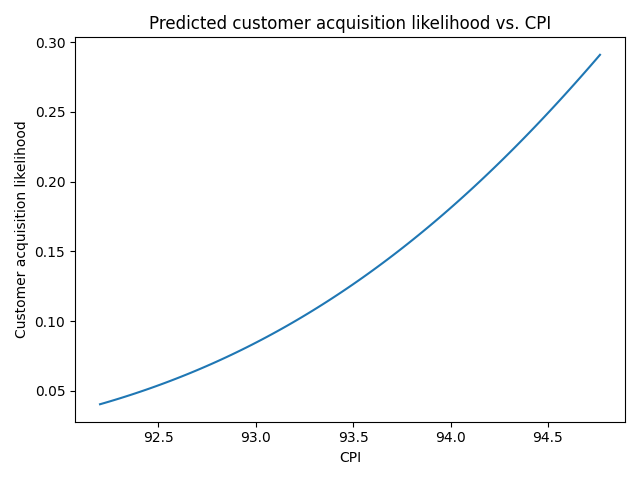
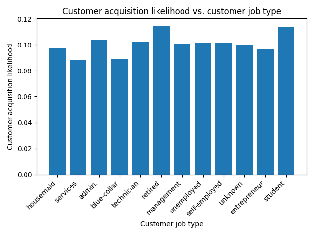
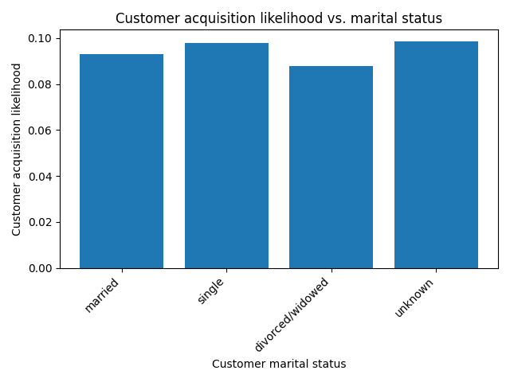
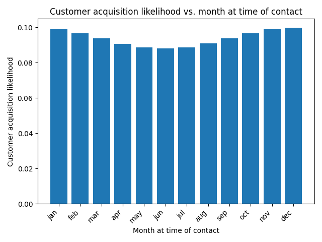

# Investigating how different factors influence likelihood of customer acquisition in bank telemarketing campaigns

## Project objective

The goal of this project is to determine how different factors influence the likelihood of customer acquisition in bank telemarketing campaigns. Our investigation looks at various ML algorithms for classification problems to model the customer acquisition likelihood as a function of these factors.

[Here is a link to the Jupyter notebook for this project.](<prompt_III notebook.ipynb>)

## Data description

Our data, which comes from Portuguese bank telemarketing campaigns, can be found in [data/bank_additional_full.csv](data/bank_additional_full.csv). The data is taken from 17 campaigns in total.

Each data point corresponds to a time a customer was contacted in a bank telemarketing campaign. The data points contain information about the contacted potential customer, the time and circumstances of the contact, and socioeconomic measures such as consumer price index, etc. The target variables is whether the customer was acquired and subscribed a term deposit, encded as "yes" or "no". 

## Findings

Below are some plots showing how used car prices varied for some different parameters.

- Customer age:
\

\
From the graph, we see that customer acquisition is much more likely for ages above around 65, but relatively lower for the age range 30-50. However, the 18-25 age range is more likely than the 30-50 age range.

- Consumer price index (CPI):
\

\
We see a clear positive correlation between CPI and customer acquisition likelihood.

- Customer job type:
\

\
We see that customer acquisition likelihood is lowered for clients in the service or blue-collar work, and is higher for both retirees and students.

- Customer marital status:
\

\
Clients who are single and never married are slightly more likely to be acquired, while clients who are divorced or widowed have a slightly lower likelihood.

- Month of contact:
\

\
Customer acquisition likelihood is slightly lower in the summer season, rises during the fall season, is slightly higher in the winter season, and again lowers during the spring season.

## Recommendations

Based on the above findings, we propose the following decisions:
- Focusing on marketing to both seniors, and the 18-25 age range.
- Invest more in marketing during times when the CPI is higher.
- Focus on marketing to retirees and students, and avoid clients in service or blue-collar work.
- Target customers who are single and never married, and avoid clients who are divorced or widowed.
- Focus on the winter season, and invest less in marketing in the summer season.

